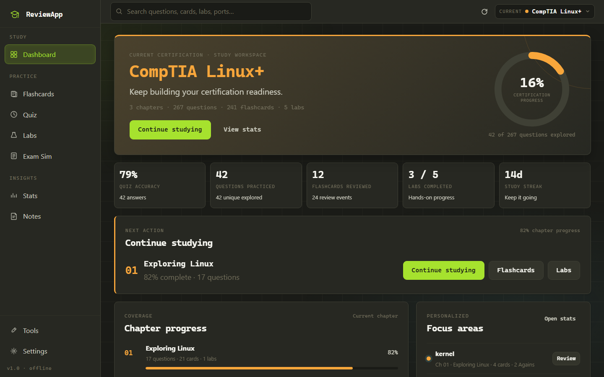
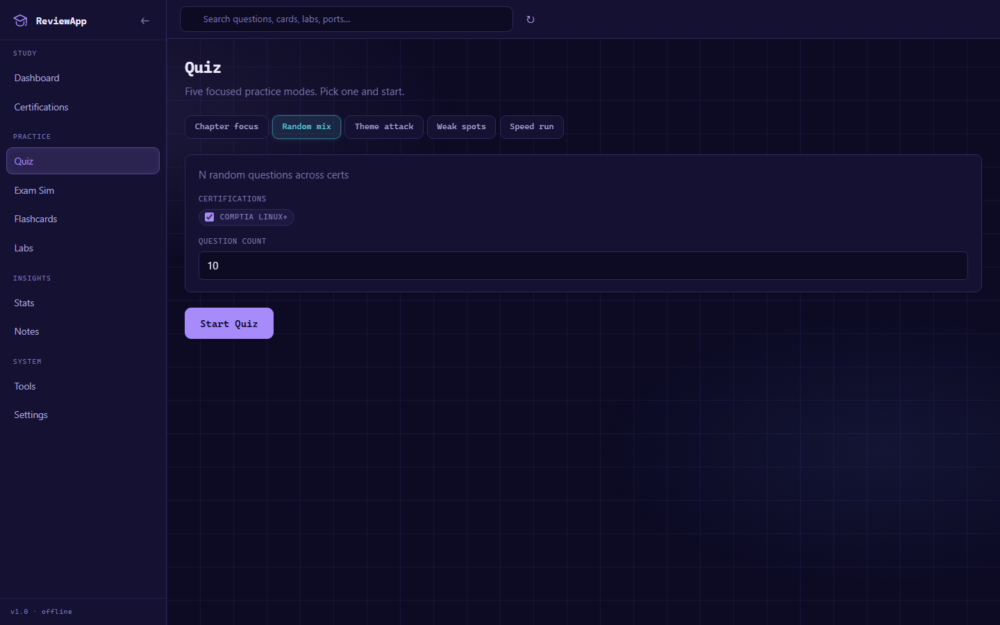
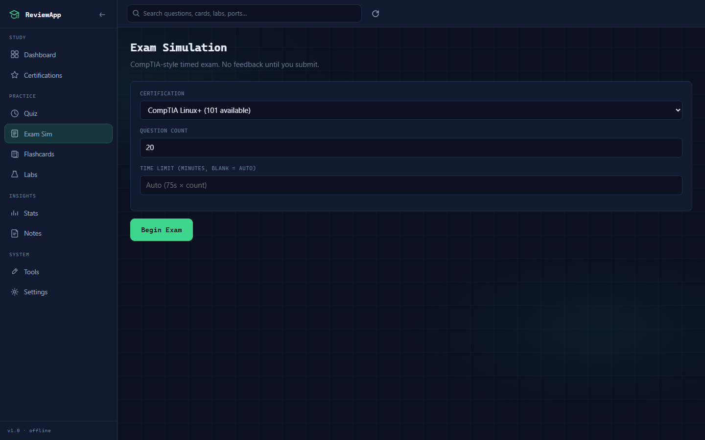
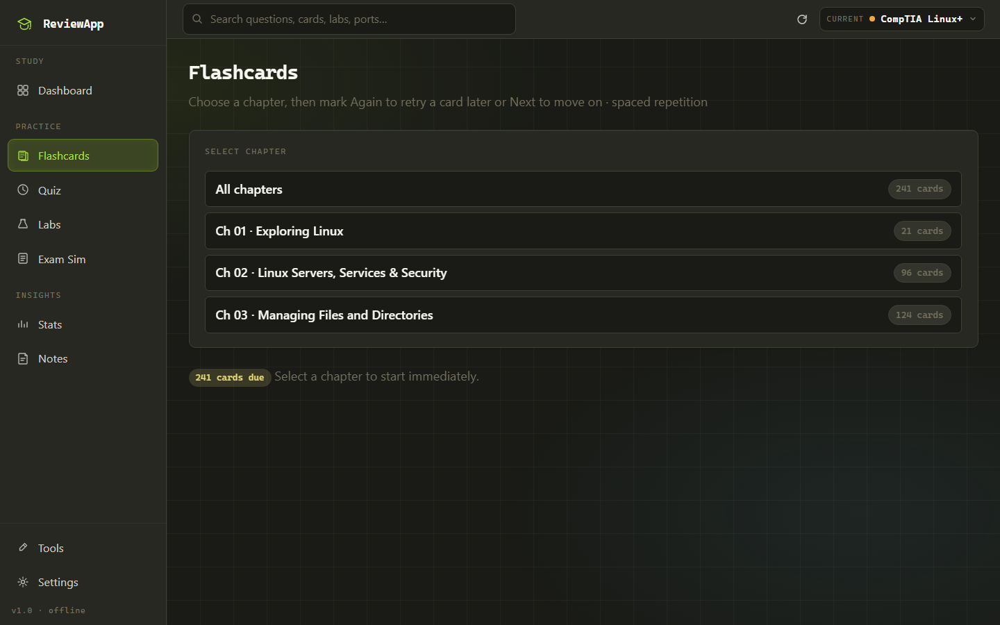
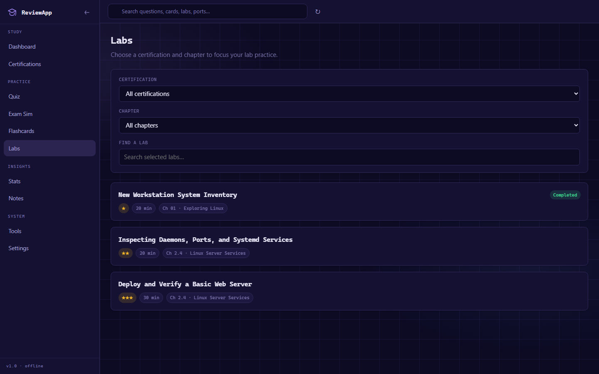
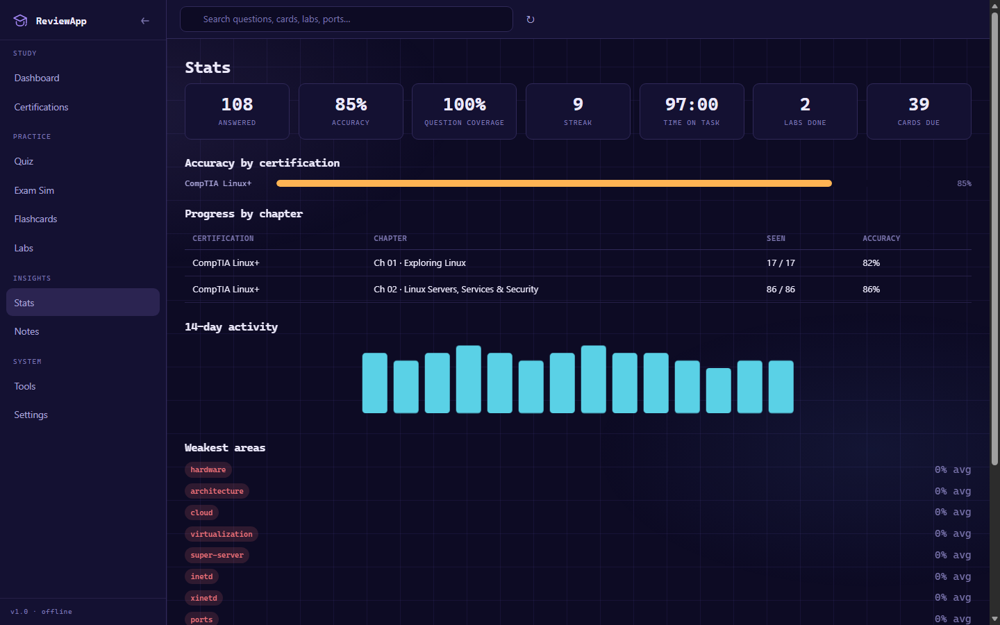

# ReviewApp

**An offline study & review hub for certification learning.**

ReviewApp is a vanilla HTML/CSS/JavaScript study platform that runs entirely
locally — no account, build step, framework, CDN, or network connection. Open
`ReviewApp.html`, pick a certification, and start studying content loaded from
the local `certifications/` directory.

It follows a **one-certification-at-a-time** model. Choose the active
certification from the **Current certification** picker in the top-right of the
top bar, and every certification-scoped view stays inside that certification.
Tools, Settings, and Global Search stay available independently, and all study
data is kept in the browser's `localStorage`.

---

## Screenshots

| Dashboard | Quiz |
|---|---|
|  |  |
| Certification-scoped progress, recommendations, activity, and chapter actions. | Five practice modes with chapter and certification context. |

| Exam Simulation | Flashcards |
|---|---|
|  |  |
| Timed exam configuration with question palette and flag-for-review. | Card review with the Again / Next workflow and spaced repetition. |

| Labs | Stats |
|---|---|
|  |  |
| Certification → chapter lab organization with hands-on scenarios. | Certification-scoped accuracy, coverage, activity, and weak areas. |

---

## Quick start

1. Open the project folder.
2. Double-click **`ReviewApp.html`**.
3. Use Chrome, Edge, Firefox, or Safari.

All progress lives in the browser's `localStorage`.

> **Tip:** If content does not load in a strict `file://` environment, open
> **Settings → Deep-scan folder…** and select the `certifications` directory.
> Any simple static HTTP server also works.

---

## Main features

- **Dashboard** — certification-scoped stats, recommendations, 14-day activity, and per-chapter progress with direct launch actions.
- **Quiz** — Chapter Focus, Random Mix, Theme Attack, Weak Spots, and Speed Run modes, with keyboard shortcuts (`1-5` to select options, Enter/Space to submit and advance).
- **Exam Simulation** — timed exam with question palette, flag-for-review, pass threshold, and keyboard answer selection.
- **Flashcards** — flip cards with Again / Next, Shuffle, a retry queue, and saved-session resume or cancel.
- **Labs** — hands-on scenarios grouped by chapter with objectives, hints, and solutions.
- **Notes** — one complete note per chapter with all source sections inside it.
- **Stats** — accuracy, coverage, streaks, activity, weak areas, and exportable reports.
- **Tools** — subnet calculator, number converter, common ports, a Linux command reference, and a permissions calculator.
- **Search** — global search across questions, flashcards, notes, ports, and commands.
- **Settings** — themes, text size, animations, exam threshold, and Backup & Data.

---

## How it works

- Study one certification at a time; switch with the **Current certification** picker.
- Certification-scoped views (Dashboard, Quiz, Exam Sim, Flashcards, Labs, Notes, Stats) always follow the active certification.
- Everything is stored locally in `localStorage` — no data is sent anywhere.
- Backup & Data creates a single dated ZIP for progress, study material, or both.

---

## Adding certifications & study content

Content is plain JavaScript that self-registers through
`certifications/_manifest.js`. Add a certification's metadata and file paths
there, then reload. See **[Adding Certifications & Content](./docs/CONTENT.md)**,
and use the full schemas in
**[CONTENT_FORMAT.md](./docs/CONTENT_FORMAT.md)** when writing content.

Prefer an AI to do the writing? The
**[AI Prompt Generator](./docs/prompt-generator.md)** has ready-made prompts you
can copy, paste your notes into, and send — the AI replies with a complete
content file.

---

## Documentation

- **[Documentation index](./docs/README.md)** — all guides at a glance
- **[Backups & Data](./docs/BACKUPS.md)** — exporting and importing ZIP backups
- **[Adding Certifications & Content](./docs/CONTENT.md)** — how to add study material
- **[Study Flows](./docs/STUDY-FLOWS.md)** — how the app is meant to be used
- **[Content Format](./docs/CONTENT_FORMAT.md)** — full question/flashcard/lab/note schemas
- **[AI Prompt Generator](./docs/prompt-generator.md)** — ready-made prompts you can copy, paste your notes into, and send to an AI

---

## Privacy / data

ReviewApp is fully offline. Your progress, answers, notes, and settings never
leave your device, and backups stay local ZIP files.

---

## Troubleshooting

- **Blank content:** use the reload button or **Settings → Deep-scan folder…**.
- **New certification not appearing:** check `_manifest.js` and reload.
- **Clicks not working:** hard-refresh (`Ctrl+F5`) or try a different browser.

---

## License / intent

Built as a personal offline study tool for certification learning. Ship your
own content, keep your data local, and study without distraction.

Created by **mfundora19**.
